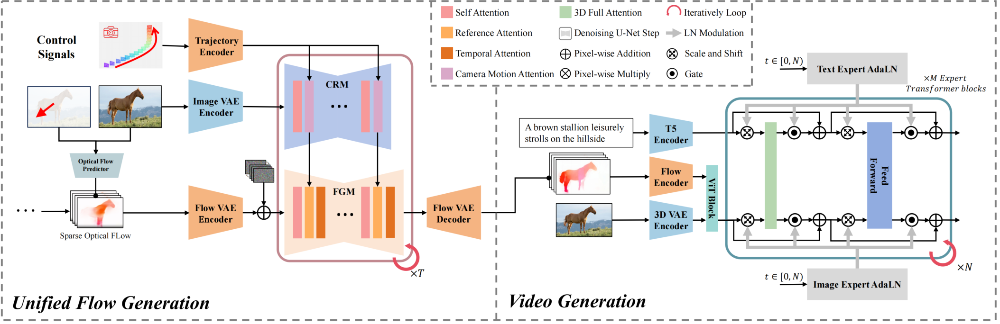

# AnimateAnything

  <div class="is-flex is-justify-content-center">
    <ul class="icon-list">
        <li>
            <a target="_blank" href="">
                 arXiv
                    <!-- <h4><strong>arXiv</strong></h4> -->
            </a>
        </li>
        <li>
            <a target="_blank" href="">
                 Paper
                    <!-- <h4><strong>arXiv</strong></h4> -->
            </a>
        </li>
    <li>
        <a target="_blank" href="https://yu-shaonian.github.io/Animate_Anything/">
            Huggingface
            <!-- <h4><strong>Github</strong></h4> -->
        </a>
    </li>           
    <li>
        <a target="_blank" href="https://yu-shaonian.github.io/Animate_Anything/">
             Project Page
                <!-- <h4><strong>Github</strong></h4> -->
        </a>
    </li> 
## OverView



## Project Updates

- 🔥🔥 We finished **camera trajectory Control**
- 🔥🔥 We finished the **User Annotation** to guide the video generation
- 🔥🔥 We finished **human animation**
- 🔥🔥 We finshed **video transfering** from a reference image
- ......... And More

## Quick Start

### Diffusers

**Please make sure your Python version is between 3.10 and 3.12, inclusive of both 3.10 and 3.12.**

```
pip install -r requirements.txt
```

## Gallery

<table border="0" style="width: 100%; text-align: left; margin-top: 20px;">
  <tr>
      <td>
          <video src="https://yu-shaonian.github.io/Animate_Anything/dynamic_scene/3_animals_ram5.jpg_openvidcheckpoint-2400_final_video.mp4" width="100%" controls autoplay loop></video>
      </td>
      <td>
          <video src="https://yu-shaonian.github.io/Animate_Anything/dynamic_scene/1_animals_2_16.jpg_openvidcheckpoint-2400_final_video.mp4" width="100%" controls autoplay loop></video>
      </td>
       <td>
          <video src="https://yu-shaonian.github.io/Animate_Anything/drag_all_direction/bear_taiji_2.mp4" width="100%" controls autoplay loop></video>
     </td>
      <td>
          <video src="https://yu-shaonian.github.io/Animate_Anything/static_scene/0_scenery_xiangge1.jpg_openvidcheckpoint-2400_final_video.mp4" width="100%" controls autoplay loop></video>
     </td>
  </tr>
  <tr>
      <td>
          <video src="https://yu-shaonian.github.io/Animate_Anything/static_scene/0_scenery_guilin8.jpg_openvidcheckpoint-2400_final_video.mp4" width="100%" controls autoplay loop></video>
      </td>
      <td>
          <video src="https://yu-shaonian.github.io/Animate_Anything/plants_growth/A_purple_flower_bud_is_striving_to_bloom.mp4" width="100%" controls autoplay loop></video>
      </td>
       <td>
          <video src="https://yu-shaonian.github.io/Animate_Anything/static_scene/0_scenery_guilin8.jpg_openvidcheckpoint-2400_final_video.mp4" width="100%" controls autoplay loop></video>
     </td>
      <td>
          <video src="https://yu-shaonian.github.io/Animate_Anything/static_scene/4_scenery_xiangge9.jpg_openvidcheckpoint-2400_final_video.mp4" width="100%" controls autoplay loop></video>
     </td>
  </tr>
</table>

## Acknowledgement

- [CogVideoX](https://github.com/THUDM/CogVideo)
- [MOFA-Video](https://github.com/MyNiuuu/MOFA-Video)

ThankS CogVideoX and MOFA-Video for their great contribution to the **AIGC**

## Citation

🌟 If you find our work helpful, please leave us a star and cite our paper. Our Code is mainly based on CogVideoX，Please Cite Them Too.


## Model-License

The code in this repository is released under the [Apache 2.0 License](LICENSE).
